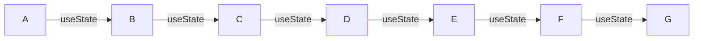
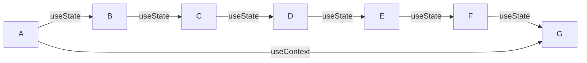

## MSquare Programing Fullstack Course
### Episode-*50* 
### Summary For `Room(1)` intermediate Class
##
- react ဟာ single page application တွေ ( SPA) ရေးတဲ့အခါ သုံးကြလေ့ရှိပါတယ်
### SPA(single page app) *vs* MPA (multi page app)
### SPA

- SPA တွေမှာ html page တစ်ခုပဲ ရှိတက်ပြီး အဲ့ဒီpage အထဲမှာ ပြသတဲ့ html တွေက dynamic ဖြစ်တဲ့ code တွေဖြစ်ပါတယ်။
- ပြောင်းလဲတစ်ခုရှိတိုင်း page တစ်ခုလုံး reload လုပ်စရာမလိုပဲ လိုအပ်တဲ့ အပိုင်းလေးကိုပဲ render လုပ်ပေးတာမလို့ user experience ကို smooth ဖြစ်ဖြစ် ပေါ့ပေါ့ပါးပါးနဲ့ ဖြစ်စေပါတယ်။
- အားနည်းချက်အဖြစ် google ကဲ့သို့ search engine တွေမှာ SPA  website များကို ရှာ မတွေ့ နိုင်တာကဲ့သို့ SEO friendly မဖြစ်နိုင်ပါ။

### MPA


- MPA တွေကတော့ SPA နဲ့ ပြောင်းပြန်လို့ပြောရပါမယ်
- SPA တွေမှာ html page အများကြီးပဲ ရှိတက်ပြီး အဲ့ဒီpageတွေကို client က ၀င်လာတဲ့အခါ **server ဆီ request လုပ် | server က response ပြန်လာတဲ့ html page တွေကို loading ပြန်လုပ်** ပြီးမှ  client ဆီ ပြပေးတာဖြစ်ပါတယ်။
- ပြောင်းလဲတစ်ခုရှိတိုင်း page တစ်ခုလုံး reload လုပ်ပြီးserver ဆီ request လုပ်ကာ ပြန်ပြပေးရတာမို့  user experience ကို smooth မဖြစ်စေပဲ resource တွေကို အများကြီးသုံးပေးရလေ့ရှိပါတယ်။
- အားသာချက်ကတော့ SEO friendly ဖြစ်ပြီး၊ အချို့ complex ဖြစ်တဲ့ app တွေမှာ SPA ထပ် MPA ကို အသုံးပြုပေးမှ အဆင်ပြေတာမျိုး ရှိတက်ပါတယ်။
##
### React မှာ index.html page တစ်ခုပဲ ရှိပြီး API ဆီ request လုပ်တာက လွဲပြီး အဲ့ဒီ page တစ်ခုထဲမှာပဲ js နဲ့ render လုပ်၊ routing လုပ် စတာတွေ လုပ်ဆောင်ပေးတာမလို့  *`client side rendering`* ဒါမှမဟုတ် *`client side routing`* လို့ သတ်မှတ်ကြပါတယ်
> စကားချပ်။   ။နောက်ပိုင်း **NextJS** ပေါ်လာတဲ့ အတွက် react ကို ***server side rendering*** အနေနဲ့လည်း အသုံးပြုလို့ ရပြီးဖြစ်ပါတယ် 
##
### State management in react
- အရင် သင်ခန်းစာတွေမှာ state  management အနေနဲ့ useState Hook ကို အသုံးပြုခဲ့ကြပါတယ်
- useState ကို အသုံးပြုပြီး props တွေကို parent component ကနေ child component တွေဆီ data တွေပို့ ခဲ့ကြပါတယ်။
- တကယ့်လက်တွေ့ မှာ component တွေ အများကြီး  ရှိတဲ့ အခါ main component မှာ state update ဖြစ်တဲ့ အချိန် ရလာမယ့် data ကို ဟိုး..အောက်ဆုံး child component ဆီ ပို့ချင်တဲ့အခါ child component တစ်ဆင့်ချင်းစီ ပို့ပေးရပါတယ်။
### နမူနာ


- A component မှာ  state update ဖြစ်ပြီး ရလာမယ့် data ကို G component ကို ပို့ချင်တယ်ဆိုပါစို့
- အဲ့ဒီအချိန်မှာ A component က Data ကို state update ဖြစ်မဖြစ် useState နဲ့ စစ်ပြီး  B ဆီ props အနေနဲ့ ပို့ ၊  B component က Data ကို state update ဖြစ်မဖြစ် useState နဲ့ စစ်ပြီး  Cဆီ props အနေနဲ့ ပို့ ၊ C component က Data ကို state update ဖြစ်မဖြစ် useState နဲ့ စစ်ပြီး  Dဆီ props အနေနဲ့ ပို့ ၊ D component က Data ကို state update ဖြစ်မဖြစ် useState နဲ့ စစ်ပြီး E ဆီ props အနေနဲ့ ပို့ ၊  E component က Data ကို state update ဖြစ်မဖြစ် useState နဲ့ စစ်ပြီး F ဆီ props အနေနဲ့ ပို့  ၊ F component ကနေ မှ  G component  state update ဖြစ်မဖြစ် useState နဲ့ စစ်ပြီး က ပြန်လက်ခံ စသည်ဖြင့် အဆင့်ဆင့် လုပ်ပေးရပါမယ်
- အထက်ပါ လုပ်ဆောင်ချက် ကို props   drilling လို့ ခေါ်ပါတယ်။
- A က data ကို G ကပဲ လိုချင်ပေမယ့် ကြားထဲက မဆိုင်တဲ့ B C D E F တွေကပါ state တွေ update လုပ် ပြီး ပွဲစားအနေနဲ့ ကြားခံ လုပ်ပေးနေရတာကို ဆိုလိုပါတယ်
- props   drilling ပြဿနာ ကို useContext  hook ကို သုံးပြီး ဖြေရှင်းလို့ရပါတယ်


##
### example of Using context hook
https://react.dev/learn/passing-data-deeply-with-context
- အထက်ပါ link မှာ အပြည့်အစုံ လေ့လာနိုင်ပါတယ်

 - **context**  ကို စမ်းသပ်အသုံးပြုကြည့်ကြပါမယ်။
 - အရင်ဆုံး tutorial မှာပါတဲ့ အတိုင်း App.js ,Section.js , Heading.js ဖိုင်သုံးခု လုပ်ပါမယ်။
```js
//App.js
import Heading from './Heading.js';
import Section from './Section.js';

export default function Page() {
  return (
    <Section>
      <Heading level={1}>Title</Heading>
      <Heading level={2}>Heading</Heading>
      <Heading level={3}>Sub-heading</Heading>
      <Heading level={4}>Sub-sub-heading</Heading>
      <Heading level={5}>Sub-sub-sub-heading</Heading>
      <Heading level={6}>Sub-sub-sub-sub-heading</Heading>
    </Section>
  );
}
```
- App.js မှာ  Heading နဲ့ Section component တွေ import လုပ်ထားပြီး section ထဲမှာ Heading tag တွေ ထည့်ပြီး  return လုပ်ထားပါတယ်။
```js
//Section.js

export default function Section({ children }) {
  return (
    <section className="section">
      {children}
    </section>
  );
```

```js
//Heading.js

export default function Heading({ level, children }) {
  switch (level) {
    case 1:
      return <h1>{children}</h1>;
    case 2:
      return <h2>{children}</h2>;
    case 3:
      return <h3>{children}</h3>;
    case 4:
      return <h4>{children}</h4>;
    case 5:
      return <h5>{children}</h5>;
    case 6:
      return <h6>{children}</h6>;
    default:
      throw Error('Unknown level: ' + level);
  }
}
``` 
- Heading component မှာ level props ကို လက်ခံထားပါတယ်။
- react app ကို start လုပ်ကြည့်ပါက ခုလိုမြင်ရမှာ ဖြစ်ပါတယ်


##


- အကယ်လို့ ညာဘက်ကပုံလို result လိုချင်တယ်ဆိုပါစို့ ။
- ဘယ်ဘက်ခြမ်းက code တွေ ရေးပေးလိုက်ရင် ရနိုင်ပေမယ့် level တွေ ထပ်ခါ ရေးထည့်ပေးနေတာကို မြင်ရမှာပါ
-   ညာဘက်ကပုံလို result လိုချင်တယ်ဆိုရင် context ကို သုံပြီး ရေးလို့ရပါတယ်


1.  **Create**  a context. (You can call it  `LevelContext`, since it’s for the heading level.)
2.  **Use**  that context from the component that needs the data. (`Heading`  will use  `LevelContext`.)
3.  **Provide**  that context from the component that specifies the data. (`Section`  will provide  `LevelContext`.)

- context တစ်ခု create လုပ်ဖို့ src folder အောက်မှာ contents ဆိုတဲ့ folder တစ်ခုလုပ်ပါ။
- အဲ့ဒီ folder ထဲမှာ context တွေကို သိမ်းမှာဖြစ်ပါတယ်
- ခု သင်ခန်းစာ အတွက် LevelContext.js ကို create လုပ်ပါမယ်
```js
//LevelContext.js

import { createContext } from 'react';

export const LevelContext = createContext(1);
```
- context တစ်ခု create လုပ်လိုက်ပြီး တန်ဖိုး  ကို 1 သတ်မှတ်ထားလိုက်ပါတယ်
- အဲ့ဒီ  LevelContext ကို လိုအပ်တဲ့ component မှာ  ခေါ်သုံးပါမယ်
- ခု သင်ခန်းစာမှာတော့ Heading component မှာ သုံးပါမယ်။
```js
// Heading.js

import { useContext } from 'react';
import { LevelContext } from './LevelContext.js';

export default function Heading({ children }) {
  const level = useContext(LevelContext);
  switch (level) {
    case 1:
      return <h1>{children}</h1>;
    case 2:
      return <h2>{children}</h2>;
    case 3:
      return <h3>{children}</h3>;
    case 4:
      return <h4>{children}</h4>;
    case 5:
      return <h5>{children}</h5>;
    case 6:
      return <h6>{children}</h6>;
    default:
      throw Error('Unknown level: ' + level);
  }
}

```
- App.js မှာ မတူညီတဲ့ heading level တွေ  ပေးထားသော်လည်း Heading component မှာ level context ကို  သုံးထားတာမလို့ text တွေ အကုန် heading level 1 ဖြစ်နေတာကို မြင်ရမှာပါ။


- Heading level တွေ အဆင့်ဆင့် အဖြစ် လိုချင်ရင် Provider ကို အသုံးပြုပေးရပါမယ်
```js
//Section.js

import { LevelContext } from './LevelContext.js';

export default function Section({ level, children }) {
  return (
    <section className="section">
      <LevelContext.Provider value={level}>
        {children}
      </LevelContext.Provider>
    </section>
  );
}

```
- အခုဆို အောက်ကပုံလို ပြပေးနေမှာ ဖြစ်ပါတယ်


- childe component ဆီ ရောက်လာမယ့် Porps ကို အနီးစပ်ဆုံး parent component က Props ရဲ့ တန်ဖိုးကို ပြောင်းလဲပြီး အသုံးပြုလို့ရပါတယ်။

```js
// Section.js

import { useContext } from 'react';
import { LevelContext } from './LevelContext.js';

export default function Section({ children }) {
  const level = useContext(LevelContext);
  return (
    <section className="section">
      <LevelContext.Provider value={level + 1}>
        {children}
      </LevelContext.Provider>
    </section>
  );
}


```
-   အခုဆိုရင် နောက်ဆုံးလိုချင်တဲ့ result ကို ရပြီး ဖြစ်ပါတယ်။


