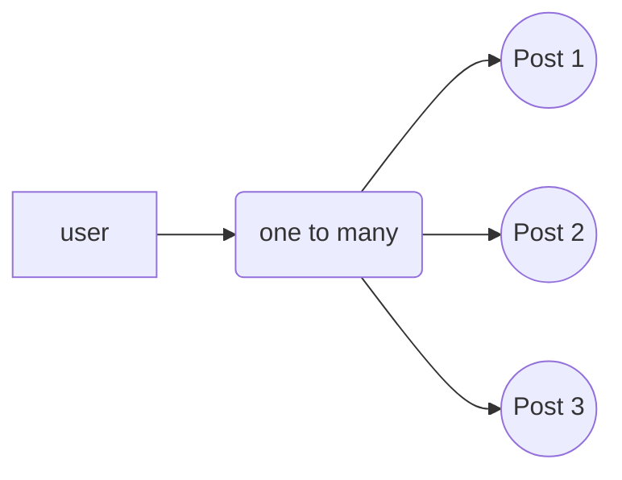
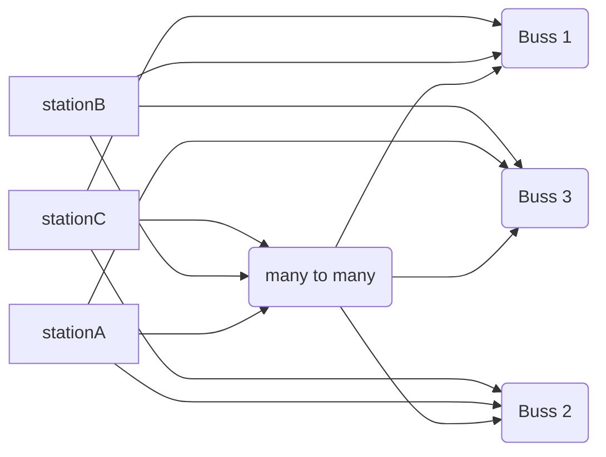


## MSquare Programing Fullstack Course
### Episode-*50* 
### Summary For `Room(1)` intermediate Class
## Postgres
### inner joins
https://www.sqlteaching.com/#!joins
- အပေါ်က link ရဲ့ lesson မှာတော့
> Can you use an inner join to pair each character name with the actor who plays them? Select the columns: **character**._name_, **character_actor**._actor_name_
- inner join ကို သုံးပြီး ဘယ် actor က ဘယ်လို ဇာတ်ကောင်နေရာ သရုပ်ဆောင်တယ်ဆိုတာကို join လုပ်ခိုင်းတာဖြစ်ပါတယ်။
```sql
SELECT character.name,character_actor.actor_name 
FROM character
INNER JOIN character_actor
ON character_actor.character_id = character.id
```
- အရင်ဆုံး character table ထဲက name နဲ့ character_actor  table ထဲက actor_name  ကို select လုပ်ပြီး
- character table ကနေ character_actor  table ကို character_actor  table ရှိ FK နဲ့ character table ထဲက PK တူတဲ့ အပေါ်မူတည်ပြီး join လုပ်လိုက်တာဖြစ်ပါတယ်
##
### Relationship in Postgres
- Postgres မှာ table တွေ ချိတ်ဆက်တဲ့ အခါ  အများအားဖြင့် relation သုံးမျိုးဖြင့် ချိတ်ဆက် အသုံးပြုကြပါတယ်
### one to one relation 
### one to many relation
### many to many relation
##
### one to one relation 
- data တစ်ခု ကနေ  တစ်ခု ဆီကိုပဲ ချိတ်ဆက်တာကို ဆိုလိုတာပါ။
- ဥပမာ ။   ။
   
   - country နဲ့ capital table နှစ်ခုရှိတယ်ဆိုပါစို့
   - အဲ့ဒီနိုင်ငံ အတွက် မြို့တော်ဟာ တစ်မြို့ပဲ ရှိတာမလို့ country id ( PK ) ကို capital မှာ FK အဖြစ် တစ်ခုပဲ ချိတ်ဆက်ထားရမှာကို ဆိုလိုတာပါ
   ##
   ### one to many relation
   - တစ်ခုကနေ အများကို ချိတ်ဆက်ပေးတာဖြစ်ပါတယ်။
   - ZOOM meeting တစ်ခုကို user အများ join ထားသလိုမျိုးပါ။
   - နောက် ဥပမာ တစ်ခုက Facebook မှာ user တစ်ယောက်က status post အများကြီး တင်ထားသလိုမျိုးပါ။
  

##
### many to many relation
- အများနဲ့ အများ ကိုချိတ်ဆက်တာဖြစ်ပါတယ်

- station A က bus 1 ,2,3 နဲ့ ချိတ်ဆက်ထားသလို
- bus 1 ကလည်း station A,B,C ကို ချိတ်ဆက်ထားပါတယ်
- ကျန်တဲ့ station တွေကလည်း bus အားလုံးနဲ့ ချိတ်ဆက်ထားသလို
- bus အားလုံးကလည်း station အားလုံးနဲ့ ချိတ်ဆက်ထားတာမလို့၏
- many to many relationship ဖြစ်ပါတယ်။
##
### multiple join
https://www.sqlteaching.com/#!multiple_joins
- အပေါ်က link ရဲ့ lesson မှာတော့
>Can you use two joins to pair each character name with the actor who plays them? Select the columns: **character**._name_, **actor**._name_
- join နှစ်ခါ လုပ်ပြီး actor name နဲ့ ဇာတ်ကောင် ကို တွဲပေးရမှာဖြစ်ပါတယ်။
```sql
SELECT character.name,actor.name
FROM character
INNER JOIN character_actor
ON 	character.id = character_actor.character_id
INNER JOIN actor 
ON character_actor.actor_id = actor.id
```

- character_actor ထဲက character_id နဲ့ character ထဲက id တူမတူ အရင်စစ်ပြီး join လိုက်ပါတယ်
- ဆက်ပြီး actor ထဲက id နဲ့ character_actor ထဲ က actor_id တူမတူ ထပ်စစ်ပြီး join ပါတယ်
- အဲ့ဒီ join တွေထဲက character.name နဲ့ actor.name ကို ရွေးထုတ်လိုက်တာဖြစ်ပါတယ်
##
### join multiple with where
https://www.sqlteaching.com/#!joins_with_where
>Can you return a list of characters and TV shows that are not named "Willow Rosenberg" and not in the show "How I Met Your Mother"?
- Willow Rosenberg ဆိုတဲ့ ဇာတ်ကောင်မပါတဲ့character  နဲ့ How I Met Your Mother ဆိုတဲ့ show မပါတဲ့  Show ကို ပြခိုင်းတာဖြစ်ပါတယ်။
```sql
SELECT character.name,tv_show.name
FROM character
INNER JOIN character_tv_show
ON character.id = character_tv_show.character_id
INNER JOIN tv_show 
ON character_tv_show.tv_show_id = tv_show.id
WHERE character.name != 'Willow Rosenberg' 
AND tv_show.name != 'How I Met Your Mother'
```
- character_tv_show ထဲက character_id နဲ့ characterထဲက id တူတဲ့ဟာကို အရင်join ပါတယ်
- ထပ်ပြီး character_tv_show ထဲက tv_show_id  နဲ့  tv_showထဲက id တူတဲ့ဟာကိုလည်း ထပ်join ပါတယ်။
- အဲ့ဒီ join လိုက်တဲ့ အထဲကမှ Willow Rosenberg ဆိုတဲ့ character name နဲ့ How I Met Your Mother ဆိုတဲ့ show မပါတဲ့ ဟာတွေကို ရွေးထုတ်လိုက်တာဖြစ်ပါတယ်
##
### Left join
https://www.sqlteaching.com/#!left_joins
>Can you use left joins to match **character names** with the **actors** that play them? 
- Left join ကို သုံးပြီး ဘယ် actor က ဘယ်လို ဇာတ်ကောင်နေရာ သရုပ်ဆောင်တယ်ဆိုတာကို join လုပ်ခိုင်းတာဖြစ်ပါတယ်။
```sql
SELECT character.name,actor.name
FROM character
LEFT JOIN character_actor 
ON character.id = character_actor.character_id
LEFT JOIN actor
ON  character_actor.actor_id = actor.id
```
- character_actor ထဲက character_id နဲ့ character ထဲက id တူမတူ အရင်စစ်ပြီး join လိုက်ပါတယ်
- ဆက်ပြီး actor ထဲက id နဲ့ character_actor ထဲ က actor_id တူမတူ ထပ်စစ်ပြီး join ပါတယ်
- အဲ့ဒီ join တွေထဲက character name နဲ့ actor name ကို ရွေးထုတ်လိုက်တာဖြစ်ပါတယ်
##
### Table alias
- table name တွေကို အတိုကောက်လုပ်ပြီး SQLမှာ သုံးတာကို ဆိုလိုတာပါ
https://www.sqlteaching.com/#!table_alias
> Can you use left joins to match character names with the actors that play them, and use aliases to make the query shorter? The aliases for **character**, **character_actor**, and **actor** should be **c**, **ca**, and **a**.

- အထက်ပါ left join lesson ကိုပဲ Table alias သုံးပြီး ပြန်ရေးခိုင်းတာဖြစ်ပါတယ်
```sql
SELECT c.name,a.name
FROM character AS c
LEFT JOIN character_actor AS ca
ON c.id = ca.character_id
LEFT JOIN actor AS a
ON  ca.actor_id = a.id
``` 
##
### Column alias
https://www.sqlteaching.com/#!column_alias
- column name တွေကို အတိုကောက်လုပ်ပြီး SQLမှာ သုံးတာကို ဆိုလိုတာပါ
- - အထက်ပါ left join lesson ကိုပဲ column alias သုံးပြီး ပြန်ရေးခိုင်းတာဖြစ်ပါတယ်
```sql
SELECT character.name AS character , actor.name AS actor
FROM character
LEFT JOIN character_actor 
ON character.id = character_actor.character_id
LEFT JOIN actor
ON character_actor.actor_id = actor.id
```
##
### Self joins
https://www.sqlteaching.com/#!self_join
> Can you run a query that returns the name of an employee and the name of their boss? Use column aliases to make the columns _employee_name_ and _boss_name_.

- table တစ်ခုထဲကိုပဲ self join လုပ်ခိုင်းထားပြီး employee_name နဲ့ boss_name ကိုရှာခိုင်းလိုက်တာဖြစ်ပါတယ်
```sql
SELECT e1.name AS employee_name,
e2.name AS boss_name
FROM employees AS e1
INNER JOIN employees AS e2
ON e1.boss_id = e2.id
```
- alias တွေ သုံးထားပြီး inner join နဲ့ table တစ်ခုထဲကို e1 e2 ခွဲပြီး select လုပ်လိုက်တာဖြစ်ပါတယ်။
## 
### like
https://www.sqlteaching.com/#!like
>Can you run a query that returns "Robot" followed by a year between 2000 and 2099?
- 2000 ကနေ 2099 အထိ ရှိတဲ့ robot name တွေကို ရှာခိုင်းတာဖြစ်ပါတယ်။
```sql
SELECT * FROM robots WHERE name LIKE "%200%"
```
- where name like ဆိုတာက နာမည်တူသကဲ့သို့ လို့ ဆိုလိုတာပါ
- JS မှာ ဆိုရင် includes နဲ့ ရှာသလိုမျိုးပါ။

- % ဆိုတာ ဘာဖြစ်ဖြစ်လို့ ယူဆနိုင်ပြီး `%200%`  ဆိုတာ ရှေ့ နောက်မှာဘာပဲရှိရှိ 200 ပါတဲ့ name တွေကို robots table ကနေ Select လုပ်လိုက်တာဖြစ်ပါတယ်။
##
### CASE
- JS မှာ **if else** ဖြင့်**conditional စစ်သကဲ့သို့** SQL မှာလဲ **CASE** ကို အသုံးပြုပါတယ်
https://www.sqlteaching.com/#!case
>Can you return the results with a column named _sound_ that returns "talk" for humans, "bark" for dogs, and "meow" for cats?
- human ဆိုရင် talk , dogs ဆိုရင် bark , cat ဆိုရင် meow လို့  sound column တစ်ခုနဲ့ ပြခိုင်းတာဖြစ်ပါတယ်။
```sql
SELECT *,
CASE 
WHEN species = 'human' THEN 'talk' 
WHEN species = 'dog'  THEN 'bark'
ELSE 'meow' 
END
AS sound
FROM friends_of_pickles;
```
##
### SUBSTR
Syntax
```sql
SUBSTR(column_name, index, number_of_characters)
```
https://www.sqlteaching.com/#!substr
>Can you return all of the robots that are located in NY?
```sql
SELECT * FROM robots WHERE SUBSTR(location, -2) LIKE 'NY';
```
- robot တွေ အကုန်လုံးထဲက location ရဲ့ တန်ဖိုး နောက်ဆုံး နှစ်လုံးမှာ NY ဖြစ်တဲ့ robot ကိုပဲ  ရှာလိုက်တာဖြစ်ပါတယ်။
##
### [COALESCE](https://www.sqlteaching.com/#!coalesce)
https://www.sqlteaching.com/#!coalesce
- သတ်မှတ်ထားတဲ့ column ထဲက null မဖြစ်တဲ့ တန်ဖိုး return လုပ်ပေးမှာဖြစ်ပါတယ်။
>Could you find each fighter's weapon in that scenario?
- fighter table ထဲ က လက်နက်တွေကို ပြခိုင်းတာဖြစ်ပါတယ်။
```sql
SELECT name, COALESCE(tank,gun, sword) AS weapon FROM fighters
```
