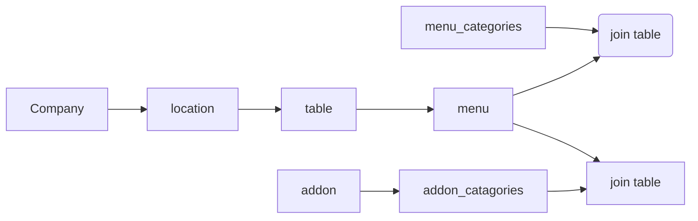

## MSquare Programing Fullstack Course
### Episode-*57* 
### Summary For `Room(1)` intermediate Class
##
## Data modeling for POS app
### ဒီနေ့ သင်ခန်းစာက စပြီး real-world project တစ်ခု အနေနဲ့ POS app တစ်ခု ဖန်တီးကြပါမယ်။
- real-world project တစ်ခု ဖန်တီးတဲ့အခါ data တွေကို စီမံခန့်ခွဲဖို့ အတွက် သေချာပြင်ဆင်ကြရပါမယ်။
- ပြည့်စုံတဲ့ data modeling ကို သေချာ စဥ်းစားတွေးခေါ်ပြီးမှ project ကို setup လုပ်ရမှာ ဖြစ်ပါတယ်။
- POS app တစ်ခု ဖန်တီးကြမှာမလို့ msquare M4 drive folder တွေထဲက 12/4/23 folder ထဲမှာ ဆရာတင်ပေးထားတဲ့ pos.drawio ကို အရင် download ဆွဲပေးပြီး draw.io မှာ သွားဖွင့်ပေးထားပါ။

## Join Table
- အရင်ဆုံး နမူနာအနေနဲ့ Menu item တစ်ခု ဖန်တီးပြီး အဲ့ဒီ menu item ကို menu category နဲ့ ချိတ်ဆက်ပါမယ် 
### menu
|    id | name   |     price|
|-------|--------|--------|
|1|Mont Him Khar      |1000 MMK  |

##

### menu_categories
|     id | name       |                        
|----------------|---------------|
|1|Hot Dish     |
|2|Cold Dish     |
|3|Most Popular   |
- Mont Him Khar ဆိုတဲ့ menu item တစ်ခု ပါတဲ့ menu table တစ်ခု လုပ်ထားပါတယ်။
- Hot Dish / Cold Dish / Most Popular ဆိုတဲ့ category တွေပါတဲ့ menu_categories table တစ်ခုလဲ လုပ်ထားပါတယ်။
- Mont Him Khar ဟာ Hot dish category ထဲမှာ ချိတ်မယ်ဆိုရင် အောက်ကလို FK အနေနဲ့ ချိတ်လိုက်လို့ ရပါတယ်။
### menu
|    id | name   |     price|     menu_categories_id|
|-------|--------|--------|--------|
|1|Mont Him Khar      |1000 MMK  |1 |

- တကယ်လို့ Mont Him Khar  က Hot dish လဲဖြစ်သလို Most popular လဲ ဖြစ်မယ်ဆိုရင် category နှစ်ခုနဲ့ ချိတ်ဆက်ပေးရပါတော့မယ်
- one menu item to many menu categories ဆိုပြီး one to many အနေနဲ့ ချိတ်ဆက်ပေးရမှာ ဖြစ်ပါတယ်။
- အဲ့ဒီလိုအခြေအနေမှာ  အထက်ပါ နမူနာ လို menu table ထဲ တိုက်ရိုက်ချိတ်ဆက်ပေးလို့ မရတော့ပဲ menu နဲ့ menu_categories ကို ကြားခံချိတ်ဆက်ပေးမယ့် join table တစ်ခု လုပ်ပေးရမှာ ဖြစ်ပါတယ်။
### menu_menu_categories ( join table)
|    id | menu_id  |     menu_categories|
|-------|--------|--------|
|1|1    |1  |
|2|1    |3 |

##
- အထက်ပါ table ကို  လေ့လာကြည့်ပါက အခုလို အဓိပ္ပါယ်ရမှာ ဖြစ်ပါတယ်။

|    id | menu_id  |     menu_categories|
|-------|--------|--------|
|1|Mont Him Khar ( id 1) |Hot Dish ( id 1) |
|2|Mont Him Khar  (id 1) |Most popular (id 3)|

### အထက်ပါ နမူနာ သင်ခန်းစာတွေ လေ့လာပြီး 12/4/23 folder ထဲမှာ ဆရာတင်ပေးထားတဲ့ pos.drawio က table တွေ ကို ချိတ်ဆက်ကြည့်ကြပါ။

example

