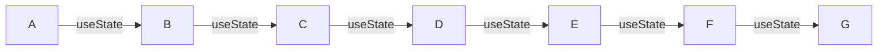
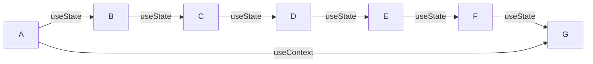

## MSquare Programing Fullstack Course
### Episode-57
## *Summary* for room-2
## React revision
### react component
- react မှာ component ဆိုတာ reusable function တစ်မျိုးပဲဖြစ်ပါတယ်
- reusable ဆိုတဲ့ အတိုင်း component တစ်ခုကို အခြား component တစ်ခုမှာ ခေါ်သုံးလို့ ရပါတယ်
### component တည်ဆောက်နည်း
```js
const App = () => {
  return (
    <div>
    App component
    </div>
  )
}
export default App;
```
##
### *Parent* and *child* component 
- component တစ်ခုကို အခြား component တစ်ခုမှာ ခေါ်သုံးတဲ့အခါ
- **ခေါ်သုံးခံရတဲ့** component ကို child component လို့ သတ်မှတ်ပြီး 
- **ခေါ်သုံးတဲ့** component ကို parent component လို့ သတ်မှတ်တယ်
```js
//ComponentA.jsx
const ComponentA = () => {
  return (
    <div>
   <h1>componentA</h1>
    </div>
  )
}
export default ComponentA;


```

```js
//ComponentB.jsx
const ComponentB = () => {
  return (
    <div>
    
   <h1>componentB</h1>
   
   <ComponentA />


    </div>
  )
}
export default ComponentB;


```
- အထက်ပါ component နှစ်ခုမှာ **ComponentA** ကို **ComponentB** ထဲမှာ ခေါ်သုံးထားတာမလို့ 
- **ComponentA** က child ဖြစ်မှာဖြစ်ပြီး 
- **ComponentB** က parent ဖြစ်မှာ ဖြစ်ပါတယ်။

##
### Props in react component
- react **Component** တစ်ခုကနေ အခြား**Component** ကို data ပို့ချင်တဲ့အခါ props ကို အသုံးပြုပါတယ်
- parent ကနေထည့်ပေးလိုက်တဲ့ props ကို child ကနေ လက်ခံလို့ရမှာဖြစ်ပါတယ်
### syntax
```
<ComponentA props-name = props-value/>
```
### example

```js
//ComponentB.jsx
const ComponentB = () => {
  return (
    <div>
    
   <h1>componentB</h1>
   
   <ComponentA user = "aung"/>


    </div>
  )
}
export default ComponentB;


```
- ခု component B ကနေ component A ကို user ဆိုတဲ့ props တစ်ခု ပို့လိုက်ပါတယ်
- အဲ့တာကို component A မှာ လက်ခံပါမယ်။
```js
//ComponentA.jsx
const ComponentA = (props) => {
  return (
    <div>
   <h1>{props.user}</h1>
    </div>
  )
}
export default ComponentA;


```
- component A မှာ props ကို parameter အနေနဲ့ လက်ခံထားပါတယ်။
- props က object အနေနဲ့ **`{ user : "aung"}`** ဆိုပြီး ၀င်လာတာမလို့ အဲ့ဒီ props ကို သုံးတဲ့အခါ props.user ဆိုပြီး အသုံးပြုပေးရပါမယ်
- react မှာ html ထဲ js expression တွေသုံးချင်ရင် **{** js **}** ထဲ ထည့်သုံးပေးရမှာဖြစ်ပါတယ်။
##
### React Hook
- react မှာ hook ဆိုတာ function တစ်မျိုးပဲ ဖြစ်ပြီး state တွေကို ထိန်းချုပ်နိုင်ဖို့အတွက် အသုံးပြုကြပါတယ်။
### State in react
- state ဆိုတာ react component တစ်ခုရဲ့ လက်ရှိအခြေအနေ ကို ဆိုလိုတာဖြစ်ပါတယ်။
- react ကို functional component နဲ့ ရေးတဲ့အခါ state တွေ သုံးလို့ရအောင် hook တွေနဲ့ ချိတ်ပေးရပါတယ်။
- react hook  ဆိုတာကလည်း function တစ်မျိုးလို့ သတ်မှတ်နိုင်ပါတယ်။
##
### useState hook
syntax
`const [ state , set-function] = useState(initialState) `
- **state** ဆိုတဲ့ နေရာမှာ useState ရဲ့ နောက် **(initialState )  ထဲက တန်ဖိုး** ၀င်လာမှာ ဖြစ်ပြီး၊
- **set-function** ကတော့  ရှေ့က **state** တန်ဖိုးကို **updateလုပ်တဲ့ function**လို့ အကြမ်းဖျင်းမှတ်သားထားပါ။


### Example code

    const [number ,setNumber] = useState(1)

##
### Using useState() hook in react
```js
// App.jsx 

import { useState } from "react";
import User from "./components/User";

const App = () => {
  const num1 = 30;
  const [name, setName] = useState("Aung");
  console.log("App component rendered...");
  return (
    <div className="App">
      <h1>My name is {name}</h1>
      <button onClick={() => setName("Myanmar")}>Click Me</button>
    </div>
  );
};

export default App;

```
> ရှင်းလင်းချက်

`import { useState } from "react";`
- useState hook ကို အသုံးပြုမှာမလို့ import လုပ်ထားပါတယ်

`const [name, setName] = useState("Aung");`
- useState hook ကို ကြေငြာထားပါတယ်
- ခု အချိန်မှာတော့ name ရဲ့ တန်ဖိုးက Aung ဖြစ်ပါတယ်။

```
return (
    <div className="App">
      <h1>My name is {name}</h1>
      <button onClick={() => setName("Myanmar")}>Click Me</button>
    </div>
  );
```
- return လုပ်ထားတဲ့နေရာမှာ name ရဲ့ တန်ဖိုးကို h1 tag အထဲ ယူသုံးထားပါတယ်
- Click Me button တစ်ခုလဲလုပ်ထားပြီး အဲ့ဒီခလုတ်ကို နှိပ်လိုက်တဲ့ အခါ useState hook ထဲက setName ဆိုတဲ့ function ကို ခေါ်လိုက်ပြီး မူလstate ရဲ့ တန်ဖိုး  ( Aung) ကို (Myanmar) အဖြစ်သို့ update လုပ်ခိုင်းထားပါတယ်
- react app ကို  start လိုက်တဲ့အခါ  အောက်ပါအတိုင်းအရင်ပြပေးမှာဖြစ်ပါတယ်။
-

- Click Me ခလုတ်ကို နှိပ်လိုက်ပါက state update ဖြစ်ပြီး အောက်ပါအတိုင်း ပြပေးမှာဖြစ်ပါတယ်


- console ထဲမှာ လဲ re-render တစ်ခါ ထပ်လုပ်ပေးသွားတာကို မြင်ရမှာပါ။
- react မှာ state ပြောင်းလဲမှု ရှိရင် ထို component ကို re-render လုပ်ပေးတာမို့လို့ ဖြစ်ပါတယ်။
##
## react context 

### State management in react
- အရင် သင်ခန်းစာတွေမှာ state  management အနေနဲ့ useState Hook ကို အသုံးပြုခဲ့ကြပါတယ်
- useState ကို အသုံးပြုပြီး props တွေကို parent component ကနေ child component တွေဆီ data တွေပို့ ခဲ့ကြပါတယ်။
- တကယ့်လက်တွေ့ မှာ component တွေ အများကြီး  ရှိတဲ့ အခါ main component မှာ state update ဖြစ်တဲ့ အချိန် ရလာမယ့် data ကို ဟိုး..အောက်ဆုံး child component ဆီ ပို့ချင်တဲ့အခါ child component တစ်ဆင့်ချင်းစီ ပို့ပေးရပါတယ်။
### နမူနာ


- A component မှာ  state update ဖြစ်ပြီး ရလာမယ့် data ကို G component ကို ပို့ချင်တယ်ဆိုပါစို့
- အဲ့ဒီအချိန်မှာ A component က Data ကို state update ဖြစ်မဖြစ် useState နဲ့ စစ်ပြီး  B ဆီ props အနေနဲ့ ပို့ ၊  B component က Data ကို state update ဖြစ်မဖြစ် useState နဲ့ စစ်ပြီး  Cဆီ props အနေနဲ့ ပို့ ၊ C component က Data ကို state update ဖြစ်မဖြစ် useState နဲ့ စစ်ပြီး  Dဆီ props အနေနဲ့ ပို့ ၊ D component က Data ကို state update ဖြစ်မဖြစ် useState နဲ့ စစ်ပြီး E ဆီ props အနေနဲ့ ပို့ ၊  E component က Data ကို state update ဖြစ်မဖြစ် useState နဲ့ စစ်ပြီး F ဆီ props အနေနဲ့ ပို့  ၊ F component ကနေ မှ  G component  state update ဖြစ်မဖြစ် useState နဲ့ စစ်ပြီး က ပြန်လက်ခံ စသည်ဖြင့် အဆင့်ဆင့် လုပ်ပေးရပါမယ်
- အထက်ပါ လုပ်ဆောင်ချက် ကို props   drilling လို့ ခေါ်ပါတယ်။
- A က data ကို G ကပဲ လိုချင်ပေမယ့် ကြားထဲက မဆိုင်တဲ့ B C D E F တွေကပါ state တွေ update လုပ် ပြီး ပွဲစားအနေနဲ့ ကြားခံ လုပ်ပေးနေရတာကို ဆိုလိုပါတယ်
- props   drilling ပြဿနာ ကို **useContext**  hook ကို သုံးပြီး ဖြေရှင်းလို့ရပါတယ်


##
### example of Using context hook
- context တစ်ခုကို အသုံးပြုနိုင်ရန် create လုပ်ပေးရပါမယ်
- context create လုပ်တဲ့အခါ default valueကို မဖြစ်မနေထည့်ပေးရပါမယ်
### Syntax
```js
import { createContext } from "react";

const testContext = createContext(default_value)
```

- တကယ့် project တွေလုပ်တဲ့အခါ function တွေ component တွေကို သက်ဆိုင်ရာ folder ထဲမှာ တစ်ခုဆီ ခွဲသိမ်းလေ့ရှိပါတယ်။
- ဥပမာ - type တွေအတွက် သီးသန့်ဖိုင်တစ်ခုခွဲပြီး သိမ်းထာဟတာမျိုး / ROUTE တွေ အတွက် သီးသန့် folder လုပ်ပြီး ခွဲ သိမ်း ထားတာမျိုးကို ဆိုလိုတာပါ

 - react မှာ context ကို အသုံးပြုနိုင်ဖို့ 
   - context ကို default value နဲ့ အရင် create လုပ်ပေးရပါမယ်။
   ```js
   const defaultContext = 1
   const context1 = createContext(defaultContext)
   ```
   - ပြီးရင် context provider component တစ်ခု create လုပ်ပေးရပါမယ်

   - context provider component ထဲမှာ ပထမ create လုပ်ထားတဲ့ context ရဲ့ default value ကို update လုပ်နိုင်မယ့် useState တစ်ခု လုပ်ပေးပြီး
   - return လုပ်တဲ့အခါ ထို state ရဲ့ တန်ဖိုးကို props အနေနဲ့ ထည့်ပေးရပါမယ်။
   - wrap လုပ်ထားတဲ့ component ကို props အနေနဲ့ လက်ခံပြီး ထို propထဲက children ကို contextProvider နဲ့ wrap ပြီး return လုပ်ပေးရပါမယ်
```js

const contextProvider = ({ children }: any) => {
  const [contextValue, setContextValue] = useState(defaultContext);

  return (
    <context1.Provider value={contextValue} >
      {children}
    </context1.Provider>
  );
};
```

   - context ကို ခေါ်သုံးမယ့် component တွေကို context provider component ထဲမှာ wrap လုပ်ပြီးမှ ခေါ်သုံးပေးရမှာ ဖြစ်ပါတယ်
 ```js
<contextProvider>
   <Children/>
</contextProvider>
```
