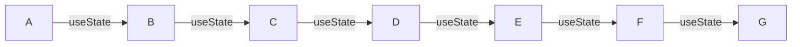
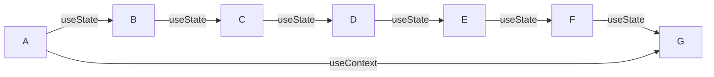

## MSquare Programing Fullstack Course
### Episode-*55* 
### Summary For `Room(2)`
## react context 

### State management in react
- အရင် သင်ခန်းစာတွေမှာ state  management အနေနဲ့ useState Hook ကို အသုံးပြုခဲ့ကြပါတယ်
- useState ကို အသုံးပြုပြီး props တွေကို parent component ကနေ child component တွေဆီ data တွေပို့ ခဲ့ကြပါတယ်။
- တကယ့်လက်တွေ့ မှာ component တွေ အများကြီး  ရှိတဲ့ အခါ main component မှာ state update ဖြစ်တဲ့ အချိန် ရလာမယ့် data ကို ဟိုး..အောက်ဆုံး child component ဆီ ပို့ချင်တဲ့အခါ child component တစ်ဆင့်ချင်းစီ ပို့ပေးရပါတယ်။
### နမူနာ


- A component မှာ  state update ဖြစ်ပြီး ရလာမယ့် data ကို G component ကို ပို့ချင်တယ်ဆိုပါစို့
- အဲ့ဒီအချိန်မှာ A component က Data ကို state update ဖြစ်မဖြစ် useState နဲ့ စစ်ပြီး  B ဆီ props အနေနဲ့ ပို့ ၊  B component က Data ကို state update ဖြစ်မဖြစ် useState နဲ့ စစ်ပြီး  Cဆီ props အနေနဲ့ ပို့ ၊ C component က Data ကို state update ဖြစ်မဖြစ် useState နဲ့ စစ်ပြီး  Dဆီ props အနေနဲ့ ပို့ ၊ D component က Data ကို state update ဖြစ်မဖြစ် useState နဲ့ စစ်ပြီး E ဆီ props အနေနဲ့ ပို့ ၊  E component က Data ကို state update ဖြစ်မဖြစ် useState နဲ့ စစ်ပြီး F ဆီ props အနေနဲ့ ပို့  ၊ F component ကနေ မှ  G component  state update ဖြစ်မဖြစ် useState နဲ့ စစ်ပြီး က ပြန်လက်ခံ စသည်ဖြင့် အဆင့်ဆင့် လုပ်ပေးရပါမယ်
- အထက်ပါ လုပ်ဆောင်ချက် ကို props   drilling လို့ ခေါ်ပါတယ်။
- A က data ကို G ကပဲ လိုချင်ပေမယ့် ကြားထဲက မဆိုင်တဲ့ B C D E F တွေကပါ state တွေ update လုပ် ပြီး ပွဲစားအနေနဲ့ ကြားခံ လုပ်ပေးနေရတာကို ဆိုလိုပါတယ်
- props   drilling ပြဿနာ ကို **useContext**  hook ကို သုံးပြီး ဖြေရှင်းလို့ရပါတယ်


##
### example of Using context hook
- context တစ်ခုကို အသုံးပြုနိုင်ရန် create လုပ်ပေးရပါမယ်
- context create လုပ်တဲ့အခါ default valueကို မဖြစ်မနေထည့်ပေးရပါမယ်
### Syntax
```js
import { createContext } from "react";

const testContext = createContext(default_value)
```

- တကယ့် project တွေလုပ်တဲ့အခါ function တွေ component တွေကို သက်ဆိုင်ရာ folder ထဲမှာ တစ်ခုဆီ ခွဲသိမ်းလေ့ရှိပါတယ်။
- ဥပမာ - type တွေအတွက် သီးသန့်ဖိုင်တစ်ခုခွဲပြီး သိမ်းထာဟတာမျိုး / ROUTE တွေ အတွက် သီးသန့် folder လုပ်ပြီး ခွဲ သိမ်း ထားတာမျိုးကို ဆိုလိုတာပါ
- အခု project ထဲမှာလဲ အဲ့ဒီလို လုပ်ထားလိုက်ပါမယ်
- context အတွက် src အောက်မှာ contexts folder တစ်ခုလုပ်ပါ။

- contexts folder အထဲမှာ PassportAppContext.ts ဖိုင် တစ်ခုလုပ်ပြီး passport app အတွက်  context တစ်ခု လုပ်ပါမယ်။
```js
// src/contexts/PassportAppContext.ts

import { createContext } from "react";

const PassportAppContext = createContext<number>(1);

export default PassportAppContext;
```
- react ကနေ createContext ကို import လုပ်ပါတယ်
- PassportAppContext ဆိုတဲ့ context တစ်ခု create လုပ်လိုက်ပြီး default value အနေနဲ့  **1** ကို ထည့်ပေးထားပါတယ်။type ကိုလည်း number အဖြစ် ပေးထားပါတယ်
- ပြီးတော့ အဲ့ဒီ context ကို export လုပ်ထားလိုက်ပါတာမလို့ ဘယ် component ကမဆို import လုပ်ပြီး အသုံးပြုလို့ရပြီး ဖြစ်ပါတယ်

- context ကို useContext နဲ့ အသုံးပြုရပါမယ်။
### syntax
```js
import {useContext} from "react";
const  contextValue = useContext(context_name)
```
- အဲ့ဒီ context ကို PassportApp component ထဲမှာ စမ်းသုံးကြည့်ပါမယ်။


- default value အနေနဲ့ ထည့်ပေးလိုက်တဲ့ 1 ကို render လုပ်ပေးတာကို မြင်ရမှာပါ။
- context ရဲ့ default value ကို ပြောင်းကြည့်လိုက်မယ်ဆိုရင် တစ်ချိန်တည်းမှာပဲ state update ဖြစ်ပြီး re-render ပြန်လုပ်ပေးကာ browser မှာ  ပြပေးတာကို မြင်ရမှာဖြစ်ပါတယ်။


## 
### Set object as context value
- ခု object တစ်ခုကို context value အနေနဲ့ ထားပေးပြီး render လုပ်ကြည့်ပါမယ်။
```js
// PassportAppContext.ts

import { createContext } from "react";

interface User {
  name: string;
  nrcNumber: string;
  dateOfBirth: string;
  phoneNumber: string;
  email: string;
}

interface BookingInfo {
  bookingDate: string;
  time: number;
  user: User;
}

const defaultContext = {
  bookingDate: "08-04-2023",
  time: 10,
  user: {
    name: "aung",
    nrcNumber: "mon223",
    dateOfBirth: "21-05-1990",
    phoneNumber: "09788",
    email: "aung@gmail.com",
  },
};

const PassportAppContext = createContext<BookingInfo>(defaultContext);

export default PassportAppContext;

```
- အရင်ဆုံး BookingInfo ဆိုတဲ့ type interface တစ်ခုလုပ်ထားပါတယ်
-  defaultContext ဆိုတဲ့ object တစ်ခု လုပ်ထားပြီး အထဲမှာ tpye လုပ်ထားတဲ့ interface နဲ့ ကိုက်ညီတဲ့ dummy data တွေထည့်ပေးထားပါတယ်။
- PassportAppContext ရဲ့  default value အဖြစ် defaultContext ဆိုတဲ့ object ကို ထည့်ပေးထားပြီး type ကို BookingInfo type အဖြစ်ပေးထားလိုက်ပါတယ်။
- ခု PassportApp.tsx မှာ context dataတွေ render လုပ်ကြည့်ပါမယ်


> ရှင်းလင်းချက်
```js
const { bookingDate, time, user } = useContext(PassportAppContext);
```
- useContext နဲ့ PassportAppContext ကို ခေါ်သုံးထားပြီး 
- PassportAppContext ရဲ့ default value အနေနဲ့ ပါလာတဲ့ object ကို _destructuring_ လုပ်ပြီး သိမ်းလိုက်ပါတယ်။

```js
<h1>Booking Date : {bookingDate}</h1>

<h1>Booking Time : {time}</h1>

<h1> user: {user.name}</h1>

<h1> Nrc Number: {user.nrcNumber}</h1>

<h1> DOB: {user.dateOfBirth}</h1>

<h1> PH number: {user.phoneNumber}</h1>

<h1> Email: {user.email}</h1>
```
- ဒါကတော့ _destructuring_  လုပ်ထားတဲ့ variable တွေကို သုံးပြီး render လုပ်ထားတာဖြစ်ပါတယ်။
